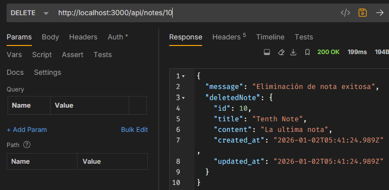
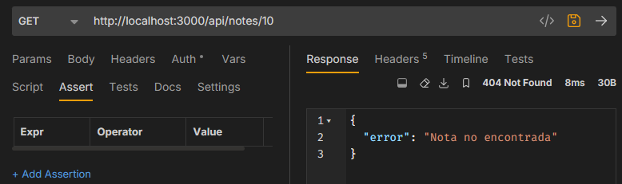

# learnign-journey-2025
Plan para estudiar backend hasta conseguir chamba sin morir en el intento, con tiempo limite de 1 año alv
Fecha de inicio: 16/12/2025

// Día 1-3: Manipulación de objetos
const users = [/* array de objetos */];
// Ejercicios: filtrar, transformar, buscar

// Día 4-6: Async/await
// Simula llamadas a DB con setTimeout
// Maneja errores correctamente

// Día 7-10: Filesystem operations
// Lee/escribe JSON files
// Crea una mini DB en archivo
```

**Semana 3-4: Node.js + PostgreSQL básico**

**PROYECTO OBLIGATORIO: "Notes API"**
x
Endpoints:
POST   /api/notes       - Crear nota
GET    /api/notes       - Listar todas
GET    /api/notes/:id   - Ver una nota
PUT    /api/notes/:id   - Actualizar
DELETE /api/notes/:id   - Eliminar

Base de datos:
CREATE TABLE notes (
  id SERIAL PRIMARY KEY,
  title VARCHAR(200) NOT NULL,
  content TEXT,
  created_at TIMESTAMP DEFAULT NOW()
);
```

**Requisitos técnicos:**
- Usar solo módulos nativos (http, fs si necesitas logs)
- PostgreSQL con pg (sin ORM)
- Validación básica (title no vacío)
- Responses JSON con status codes correctos
- Manejo de errores en try/catch
- README con instrucciones
- Deploy en Render o Railway

**Deadline: 30 días. NO NEGOCIABLE.**

---
**ScreenShots**
-  GET a /api/notes/


-  POST en /api/notes/ para adicionar notas


-  Verificación de Notas creadas con GET en /api/notes/


-  GET a /api/notes/:id 


-  PUT  a /api/notes/:id


-  DELETE a /api/notes/:id


- Verificación de error 404 (Not found)



#### **MES 2: AUTENTICACIÓN + EXPRESS**
**Meta:** Sistema de usuarios con login/register deployado

**Semana 1: Express.js básico**
- Routing
- Middleware concept
- Body parsing
- Error handling middleware

**Semana 2-3: Autenticación**
- bcrypt para passwords
- JWT (access tokens)
- Middleware de autenticación
- Protected routes

**PROYECTO: "Auth API"**
```
POST   /api/auth/register
POST   /api/auth/login
GET    /api/auth/me         (protected)
POST   /api/auth/logout

POST   /api/posts           (protected)
GET    /api/posts
GET    /api/posts/:id
PUT    /api/posts/:id       (protected, solo autor)
DELETE /api/posts/:id       (protected, solo autor)

Tables:
users (id, email, password_hash, name, created_at)
posts (id, user_id, title, content, created_at)
```

**Requisitos adicionales:**
- Email único
- Password mínimo 8 caracteres
- Token expira en 24h
- Solo el autor puede editar/borrar su post

---

#### **MES 3: RELACIONES + VALIDACIÓN**
**Meta:** Blog API con usuarios, posts y comentarios

**PROYECTO: "Blog API"**
```
Tables:
users (id, email, password_hash, name, role, created_at)
posts (id, author_id, title, content, published, created_at)
comments (id, post_id, user_id, content, created_at)
categories (id, name)
post_categories (post_id, category_id)

Features:
- CRUD posts (con paginación)
- CRUD comments
- Filtrar posts por categoría
- Buscar posts por título
- Sistema de roles (admin, user)
- Solo admins pueden borrar cualquier comment
```

**Nuevas skills:**
- JOINs múltiples
- Paginación (LIMIT, OFFSET)
- express-validator
- Índices en PostgreSQL (created_at, author_id)

---

#### **MES 4: ARQUITECTURA + TESTING**
**Meta:** Refactorizar proyecto anterior + tests

**Estructura profesional:**
```
src/
  controllers/
  routes/
  middleware/
  models/
  utils/
  config/
  tests/
```

**Testing con Jest:**
- Unit tests para funciones puras
- Integration tests para endpoints
- Mocking de DB

**Nuevas features al Blog:**
- Upload de imágenes (Cloudinary)
- Rate limiting
- CORS configurado
- Logging con Winston o Morgan

---

#### **MES 5-6: PROYECTO COMPLEJO**
**Meta:** E-commerce Backend

**PROYECTO: "Shop API"**
```
Entidades principales:
- Users (con addresses)
- Products (con inventory)
- Categories
- Cart
- Orders (con order items)
- Reviews

Features clave:
- Stock management
- Cart persistence
- Order creation (transacciones)
- Payment intent simulation (Stripe test)
- Product search y filtros avanzados
- Admin dashboard endpoints
```

**Complejidad adicional:**
- Transacciones SQL (order creation reduce stock)
- Cálculos (totales, subtotales, shipping)
- Estados de orden (pending, paid, shipped, delivered)
- Email notifications (NodeMailer con Mailtrap)

---

#### **MES 7-8: HERRAMIENTAS PROFESIONALES**

**Semana 1-2: ORM**
- Prisma setup
- Migrations
- Relations
- Queries avanzadas

**Proyecto:** Rehacer Notes API o Auth API con Prisma (rápido, ya sabes la lógica)

**Semana 3-4: Docker + CI/CD**
- Dockerfile para tu app
- docker-compose (app + postgres)
- GitHub Actions (tests + deploy automático)

**Proyecto:** Dockerizar el E-commerce

---

#### **MES 9-10: PROYECTO PORTFOLIO STAR**

**Meta:** Tu mejor proyecto - el que muestra en entrevistas

**Opciones:**
1. **Task Management con Teams** (tipo Trello/Asana simplificado)
2. **API de Cursos Online** (tipo Udemy backend)
3. **Sistema de Reservas** (restaurantes, citas médicas, etc.)

**Debe tener:**
- Autenticación robusta (JWT + refresh tokens)
- Roles complejos (admin, team lead, member, etc.)
- Relaciones N:M múltiples
- Websockets (real-time updates) - Socket.io
- File uploads
- Email notifications
- Testing 60%+ coverage
- Docker
- CI/CD
- Documentación Swagger completa
- Deploy producción con dominio custom (Namecheap $1/año)

**Este proyecto debe:**
- Estar en inglés (código, commits, README)
- Tener 300+ commits bien descritos
- README profesional con screenshots/GIFs
- Arquitectura limpia y escalable

---

#### **MES 11: PULIR PORTFOLIO**

**Tareas:**
1. **Revisar TODOS tus proyectos anteriores:**
   - README profesional en cada uno
   - Deploy funcionando
   - Código limpio (refactorizar si es necesario)
   - Comentarios donde sea complejo

2. **CV Técnico:**
```
Tu nombre
Backend Developer

[Tu ciudad], Ecuador
email | github.com/tu-user | linkedin.com/in/tu-user

TECH STACK
Languages: JavaScript (ES6+), SQL
Backend: Node.js, Express.js
Databases: PostgreSQL, (MongoDB si aprendiste)
Tools: Git, Docker, Postman, Jest
Cloud: Render/Railway, Cloudinary

PROJECTS
[Proyecto Portfolio] - Brief description
- Tech used
- Key features implemented
- Link to live + GitHub

[E-commerce API] - Brief description
- Tech used
- Achievement (handled X concurrent users, etc.)
- Link

[3 more projects...]

EDUCATION
Autodidacta (20XX - presente)
- 500+ horas programación backend
- 8 proyectos fullstack deployados

Técnico en Electricidad - [Institución]
```

3. **LinkedIn profesional:**
   - Foto profesional (no selfie)
   - Headline: "Backend Developer | Node.js, PostgreSQL | Building scalable APIs"
   - About bien escrito (en inglés)
   - Proyectos como "experience"
   - Skills endorsements

4. **GitHub profile README:**
   - Stats
   - Tech stack con iconos
   - Featured projects
   - "Currently learning..."

---

#### **MES 12: JOB HUNTING AGRESIVO**

**Objetivo: 100 aplicaciones mínimo**

**Plataformas:**
- LinkedIn (daily)
- AngelList/Wellfound
- Remote.co
- WeWorkRemotely
- Trabajos remotos Ecuador/LATAM
- Getonbrd (LATAM)
- Torre.ai
- Empresas locales Guayaquil/Ecuador

**Estrategia:**
1. **20-30 aplicaciones por semana**
2. **Customizar CV por empresa** (keywords del job posting)
3. **Cold messages en LinkedIn** a recruiters/devs de empresas que te gustan
4. **Networking:** unirte a comunidades (Discord, Slack de devs Ecuador/LATAM)

**Preparación entrevistas:**
- LeetCode Easy (20 problemas)
- Explicar tus proyectos sin mirar código
- System design básico (cómo escalarías tu e-commerce)
- Questions to ask the interviewer (siempre tener 3-4)

**Rango salarial realista Ecuador (remoto):**
- Junior local: $600-$1000
- Junior remoto LATAM: $800-$1500
- Junior remoto USA/Europa: $1500-$2500

**NO rechaces ofertas de $600-800 si es tu primer trabajo.** La experiencia de 6-12 meses vale MÁS que la diferencia salarial.

---

## SOBRE LA IA EN TU FLUJO

**Cómo usar IA CORRECTAMENTE:**

✅ **Úsala para:**
- Explicarte conceptos que no entiendes (después de intentar solo)
- Revisar tu código y sugerir mejoras
- Generar tests boilerplate
- Crear seed data para tu DB
- Debugging (después de intentar 30 min solo)

❌ **NO la uses para:**
- Generar proyectos completos sin entender
- Copy-paste sin leer/entender
- Evitar pensar en la lógica
- Reemplazar la documentación oficial

**Regla de oro:** Si no puedes explicar en detalle cada línea del código que la IA generó, **NO LO USES**.

---

## SISTEMA DE ACCOUNTABILITY

### Tracking Semanal

**Crea un documento donde registres cada semana:**
```
SEMANA X (Fecha)
Horas reales de código: XX/40
Proyecto actual: [nombre]
Progreso: XX%

Completado esta semana:
- [ ] Feature 1
- [ ] Feature 2
- [ ] Deploy

Bloqueado en:
- [Problema específico]

Plan próxima semana:
- [ ] Task 1
- [ ] Task 2

Reflexión:
¿Qué aprendí? ¿Qué haría diferente?
